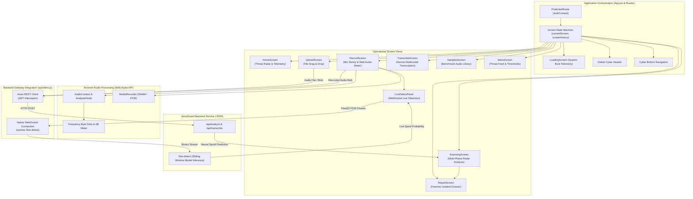

# 🛡️ VoiceGuard AI — Cyber Forensics Dashboard & Audio Sentry Interface

[](https://react.dev/)
[](https://vitejs.dev/)
[](https://reactrouter.com/)
[](https://motion.dev/)
[](https://lucide.dev/)
[](https://axios-http.com/)
[](LICENSE)

> **Next-Generation Cybernetic User Interface & Real-Time Audio Deepfake Sentry**  
> Developed for **Smart India Hackathon (SIH 2026) — Problem Statement SIH26104**.

---

### 🔗 Cross-Repository Navigation
- **Looking for the Node.js Gateway & PyTorch Inference Engine?**  
  👉 **[Explore Backend Documentation & ML Architecture](../backend/README.md)**

---

## 📋 Table of Contents

1. [Executive Overview](#executive-overview)
2. [Interface & Visual Architecture](#interface--visual-architecture)
3. [Comprehensive Tech Stack](#comprehensive-tech-stack)
4. [Acoustic Forensics & Machine Learning Integration](#acoustic-forensics--machine-learning-integration)
   - [How the UI Interacts with the ML Model](#1-how-the-ui-interacts-with-the-ml-model)
   - [Forensic Acoustic Telemetry Breakdown](#2-forensic-acoustic-telemetry-breakdown)
   - [Live Streaming Audio Detection via WebSocket](#3-live-streaming-audio-detection-via-websocket)
   - [Multimodal Speech Transcription & Phishing Intent](#4-multimodal-speech-transcription--phishing-intent)
5. [Core Screen Modules & User Journeys](#core-screen-modules--user-journeys)
6. [Design System & Styling Philosophy](#design-system--styling-philosophy)
7. [Codebase & Directory Structure](#codebase--directory-structure)
8. [Environment Variables & Configuration](#environment-variables--configuration)
9. [Installation & Local Setup](#installation--local-setup)
10. [Production Build & Deployment](#production-build--deployment)
11. [Future Scope & UI/UX Roadmap](#future-scope--uiux-roadmap)

---

## 🎯 Executive Overview

Modern social engineering attacks powered by generative AI voice cloning (such as CEO fraud, grandparent scams, and banking impersonation) operate within seconds. Defense teams and end-users need instantaneous visual verification, transparent acoustic proof, and real-time audio monitoring.

**VoiceGuard AI Frontend** (`EchoNova-project`) serves as the command-and-control sentry interface:
- **Real-Time Microphone Sentry**: Continuous browser microphone capture with live frequency spectrum visualizers, dB sound meters, and sub-300ms WebSocket clone alerts.
- **Drag-and-Drop Forensic Inspector**: Multi-format audio file analysis with immediate playback and multi-stage neural scanning animations.
- **Explainable Acoustic Forensics**: Detailed incident reporting displaying glottal pulse anomalies, spectral discontinuity timelines, harmonic diffusion rates, and phase cutoffs.
- **Multimodal AI Transcription**: Speech-to-text powered by Google Gemini, highlighting high-risk urgency phrases and social engineering triggers.
- **Enterprise Dark-Mode Cybernetic Aesthetic**: Glassmorphism, neon HUD indicators, animated radar sweeps, and responsive layouts tailored for mobile, tablet, and SOC command centers.

---

## 🏛️ Interface & Visual Architecture

The frontend is built as a reactive Single Page Application (SPA) orchestrating state, network requests, audio telemetry, and deep neural predictions through a dedicated state machine:



---

## 💻 Comprehensive Tech Stack

| Domain | Technology / Library | Version | Role in VoiceGuard Frontend |
|---|---|---|---|
| **Core Framework** | React 19 | `^19.0.1` | Ultra-fast virtual DOM, modern hooks (`useTransition`, `useRef`, `useCallback`) |
| **Build & Bundler** | Vite | `^6.2.3` | Lightning-fast HMR (Hot Module Replacement) and optimized tree-shaken production bundles |
| **Routing** | React Router DOM | `^7.6.2` | Declarative client-side routing, protected route boundaries, and dynamic navigation |
| **Animation Engine** | Motion (`motion`) | `^12.23.24` | Hardware-accelerated fluid UI transitions, radar scans, and alert pulses |
| **Cyber Iconography** | Lucide React | `^0.546.0` | Comprehensive security, waveform, shield, and threat iconography |
| **Networking & HTTP** | Axios | `^1.7.9` | Promise-based HTTP client with automatic JWT token injection and 401 auto-logout |
| **Real-Time Streaming** | Native Browser `WebSocket` | Standard W3C | Low-latency full-duplex binary audio streaming to backend `/live-detect` |
| **Audio Processing** | Web Audio API | Standard W3C | In-browser `AudioContext`, `AnalyserNode`, Fast Fourier Transform (FFT) visualization |
| **Styling & Theme** | Vanilla CSS Design System | Custom CSS3 | 45KB curated Cyberpunk dark-mode design system with HSL variables and glassmorphism |

---

## 🧠 Acoustic Forensics & Machine Learning Integration

### 1. How the UI Interacts with the ML Model
The frontend interfaces with the backend's **Wav2Vec 2.0 + Attentive Statistics Pooling (`SSLSpoofDetector`)** model through two complementary pathways:

1. **Batch Analysis Mode (`/api/analyze`)**:
   - Audio files captured via the microphone or uploaded via drag-and-drop are sent as `multipart/form-data` or Base64 payloads.
   - While the backend executes the model, the frontend displays `ScanningScreen.jsx`, a 4-phase radar visualization illustrating:
     - **Phase 1**: Acoustic Decompression & 16 kHz Resampling
     - **Phase 2**: Transformer Feature Extraction (Wav2Vec2 Layers 1–10)
     - **Phase 3**: Fine-Tuned Representation & Attentive Statistics Pooling
     - **Phase 4**: Domain Calibration & Forensic Anomaly Verification
   - Upon completion, the application auto-navigates to `ReportScreen.jsx`, displaying the authentic vs. cloned verdict and detailed forensic evidence.

2. **Live Streaming Mic Mode (`/live-detect`)**:
   - `LiveDetectPanel.jsx` opens a persistent WebSocket connection to the backend.
   - As the user speaks into the microphone, audio chunks are streamed every second.
   - The backend runs inference and returns a real-time spoof probability ($0.0 \text{ to } 1.0$), dynamically updating the live threat gauge and triggering glowing neon alerts if confidence exceeds the configured sensitivity threshold.

### 2. Forensic Acoustic Telemetry Breakdown
The UI renders real acoustic telemetry derived from the deep learning model and acoustic feature extractors:

| Metric in Report UI | Normal Human Speech | AI-Generated / Cloned Voice | Forensic Significance |
|---|---|---|---|
| **Classification Verdict** | `Authentic Human` (Green) | `Cloned / AI-Generated` (Red) | Output of the 2-class softmax from the fine-tuned classifier head |
| **Spoof Probability** | $\le 0.05$ ($< 5\%$) | $\ge 0.85$ ($> 85\%$) | Bayesian posterior probability $P(\text{spoof} \mid \mathbf{x})$ |
| **Glottal Pulse Window** | Continuous, natural jitter | Flagged (e.g. `0:04 - 0:09`) | Pinpoints exact time intervals where vocal fold opening/closing lacks micro-fluctuations |
| **Spectral Discontinuity** | Smooth formant transitions | Flagged (e.g. `0:14 - 0:18`) | Discontinuities left by vocoders (HiFi-GAN, WaveGlow) when stitching phoneme boundaries |
| **Neural Consistency** | Low consistency ($< 10\%$) | High consistency ($> 90\%$) | Degree to which deep speech representations fit known synthetic acoustic manifolds |
| **Harmonic Diffusion Match**| Low ($1.2\%$) | High ($> 80\%$) | Identifies signature high-frequency phase drift common to diffusion-based speech synthesis |
| **Phase Cutoff** | Full Spectrum (24-bit PCM) | Hard Cutoff (e.g. `4.2 kHz`) | Detects aggressive low-pass filtering and lossy vocoder compression artifacts |

### 3. Live Streaming Audio Detection via WebSocket
`LiveDetectPanel.jsx` connects directly to the backend WebSocket server:
```javascript
// Automatic protocol detection (ws:// for HTTP, wss:// for HTTPS)
const wsUrl = getWsUrl('/live-detect');
const socket = new WebSocket(wsUrl);

socket.onmessage = (event) => {
  const data = JSON.parse(event.data);
  // data: { score: 0.942, verdict: 'cloned', alert: true, timestamp: 1726481200000 }
  setLiveScore(data.score);
  setIsCloned(data.verdict === 'cloned');
};
```

### 4. Multimodal Speech Transcription & Phishing Intent
`TranscribeScreen.jsx` connects to Google's Gemini multimodal AI:
- Translates conversational audio into verbatim written text.
- Performs automated threat heuristics searching for high-risk social engineering keywords (e.g., *"wire transfer"*, *"confidential password"*, *"urgent emergency"*, *"bank account verification"*).
- Features a **"Send to Deep Scan"** button that transfers the transcribed recording directly into the neural voice clone detector for immediate acoustic verification.

---

## 🖥️ Core Screen Modules & User Journeys

```
 ┌────────────────────────────────────────────────────────────────────────┐
 │                              Header.jsx                                │
 │   [VoiceGuard AI Status: ARMED]              [Profile / Settings Modal]│
 ├────────────────────────────────────────────────────────────────────────┤
 │                                                                        │
 │   ┌──────────────────────┐              ┌──────────────────────────┐   │
 │   │      HomeScreen      │              │       RecordScreen       │   │
 │   │  • Threat Radar HUD  │ ───────────► │  • Real-Time dB Meter    │   │
 │   │  • System Readiness  │              │  • FFT Spectrum Wave     │   │
 │   │  • Recent Scan Logs  │              │  • Live WebSocket Toggle │   │
 │   └──────────┬───────────┘              └─────────────┬────────────┘   │
 │              │                                        │                │
 │              │ Drag-and-drop file                     │ Record blob    │
 │              ▼                                        ▼                │
 │   ┌──────────────────────┐              ┌──────────────────────────┐   │
 │   │     UploadScreen     │              │      ScanningScreen      │   │
 │   │  • Audio Inspector   │ ───────────► │  • 4-Phase Radar Telemetry│  │
 │   │  • Deep / Fast Mode  │              │  • Neural Feature Slicing│   │
 │   └──────────────────────┘              └─────────────┬────────────┘   │
 │                                                       │                │
 │                                                       ▼ Scan Completed │
 │   ┌──────────────────────┐              ┌──────────────────────────┐   │
 │   │   TranscribeScreen   │              │       ReportScreen       │   │
 │   │  • Gemini Speech STT │              │  • Authentic vs Cloned   │   │
 │   │  • Phishing Scanner  │              │  • Glottal / Discontinuity│  │
 │   │  • One-Click DeepScan│              │  • Export PDF / Markdown │   │
 │   └──────────────────────┘              └──────────────────────────┘   │
 ├────────────────────────────────────────────────────────────────────────┤
 │                              BottomNav.jsx                             │
 │   [Home]     [Upload Scan]     [Mic Sentry]     [Transcribe]    [Alerts]│
 └────────────────────────────────────────────────────────────────────────┘
```

### Detailed Screen Profiles:
1. **`HomeScreen.jsx`**: Central command center featuring a circular Threat Radar, active system security level, quick access buttons to launch scans, and an audit table of recent voice inspections.
2. **`RecordScreen.jsx`**: Live audio sentry. Uses the browser's `AudioContext` and `AnalyserNode` to render animated decibel meters and frequency spectrum bars while capturing high-fidelity audio.
3. **`LiveDetectPanel.jsx`**: Floating or embedded live gauge that receives continuous WebSocket updates, alerting users within milliseconds if a synthetic voice is detected during an ongoing call.
4. **`UploadScreen.jsx`**: Drag-and-drop zone accepting WAV, MP3, WebM, and AAC files. Includes integrated audio playback, file duration calculation, and scan mode selection.
5. **`ScanningScreen.jsx`**: Full-screen radar scan visualizer with progress bar and animated status updates that simulates deep neural feature extraction.
6. **`ReportScreen.jsx`**: Comprehensive cyber forensic incident report. Highlights whether the audio is real or cloned, displays confidence percentages, isolates glottal pulse windows, and offers downloadable reports.
7. **`TranscribeScreen.jsx`**: Speech-to-text interface with Gemini integration, automated phishing phrase detection, and export capabilities.
8. **`SamplesScreen.jsx`**: Benchmark demonstration gallery featuring pre-verified genuine human speech vs. synthetic voice clones (ElevenLabs, StyleTTS2, VITS) for instant live demonstrations.
9. **`AlertsScreen.jsx`**: Threat stream of detected security incidents, configurable detection sensitivity thresholds (Low, Medium, High, Paranoid), and automated quarantine toggles.
10. **`ProfileModal.jsx`**: Security analyst credentials, scanning metrics, and preferences synchronized with MongoDB.
11. **`LoadingScreen.jsx`**: Boot sequence animation simulating system initialization, audio DSP calibration, and neural network handshake.

---

## 🎨 Design System & Styling Philosophy

VoiceGuard AI frontend uses a bespoke **Vanilla CSS Cybernetic Design System** (`index.css`):
- **Deep Void Background (`#030712`)**: True dark-mode canvas designed to minimize eye fatigue during extended SOC shifts.
- **Curated HSL Color Tokens**:
  - `Accent Safe`: Emerald Green (`hsl(152, 76%, 50%)`) for verified authentic human voices.
  - `Accent Threat`: Crimson Neon (`hsl(354, 84%, 57%)`) for confirmed voice clones.
  - `Accent Cyber`: Cobalt Blue (`hsl(224, 76%, 58%)`) for active telemetry and neural processing.
  - `Accent Warning`: Electric Amber (`hsl(41, 96%, 56%)`) for suspicious or low-confidence samples.
- **Glassmorphism**: `backdrop-filter: blur(16px)` with semi-transparent border strokes (`rgba(255, 255, 255, 0.08)`).
- **Interactive Micro-Animations**: Smooth hover states, glowing border animations, radar pulse rings, and responsive touch feedback.
- **Mobile-First Responsive Layout**: Adaptive CSS grid and flexbox configurations that scale seamlessly from 360px mobile screens up to 4K SOC monitors.

---

## 📁 Codebase & Directory Structure

```
frontend/
├── .env                       # Frontend environment configuration (VITE_API_URL)
├── index.html                 # HTML5 entry point with cybernetic title and meta tags
├── package.json               # Frontend dependencies, scripts, and build metadata
├── vite.config.js             # Vite 6 configuration with React plugin and dev proxy
├── public/                    # Static assets, icons, and benchmark audio samples
│
└── src/
    ├── main.jsx               # React 19 application mount point with BrowserRouter
    ├── App.jsx                # Main screen router, global state orchestrator, modals
    ├── index.css              # Custom CSS design system (tokens, animations, glassmorphism)
    ├── types.js               # Shared data types and prop-type documentation
    │
    ├── api/
    │   └── client.js          # Axios client with JWT interceptors, API calls, getWsUrl()
    │
    ├── context/
    │   └── AuthContext.jsx    # React Authentication Context (login, register, logout, token)
    │
    ├── data/
    │   └── mockData.js        # Fallback benchmark samples, default settings, initial telemetry
    │
    ├── pages/
    │   ├── LoginPage.jsx      # Cyber security officer login interface
    │   └── RegisterPage.jsx   # New security analyst registration interface
    │
    ├── components/
    │   ├── AlertsScreen.jsx   # Threat alert feed, threshold sliders, quarantine control
    │   ├── BottomNav.jsx      # Cybernetic mobile bottom navigation bar
    │   ├── Header.jsx         # Status indicator, breadcrumb navigation, profile button
    │   ├── HomeScreen.jsx     # Threat radar HUD, security metrics, quick scan trigger
    │   ├── LiveDetectPanel.jsx# Real-time WebSocket audio streaming gauge
    │   ├── LoadingScreen.jsx  # System boot sequence with animated telemetry
    │   ├── ProfileModal.jsx   # User settings, threshold preferences, scan counts
    │   ├── RecordScreen.jsx   # Web Audio mic capture, decibel meter, live stream trigger
    │   ├── ReportScreen.jsx   # Forensic incident report with glottal & spectral evidence
    │   ├── SamplesScreen.jsx  # Pre-curated authentic vs cloned voice benchmark library
    │   ├── ScanningScreen.jsx # 4-phase radar scanning visualization
    │   ├── TranscribeScreen.jsx # Gemini multimodal speech transcription & phishing analysis
    │   └── UploadScreen.jsx   # Drag-and-drop audio file upload and inspection
    │
    └── utils/
        └── audioHelper.js     # Web Audio API helpers, blob formatting, base64 converters
```

---

## ⚙️ Environment Variables & Configuration

Create or update `.env` in the `frontend/` directory:

```env
# URL of the VoiceGuard Backend API
# During local development:
VITE_API_URL=http://localhost:5000

# For production deployment (e.g. Render):
# VITE_API_URL=https://voice-guard-j83m.onrender.com
```

> [!NOTE]
> The WebSocket utility `getWsUrl()` in `src/api/client.js` automatically converts `http://` to `ws://` and `https://` to `wss://` based on `VITE_API_URL`.

---

## 🚀 Installation & Local Setup

### Prerequisites
1. **Node.js**: v18.0.0 or higher (`node -v`)
2. **npm**: v9.0.0 or higher (`npm -v`)
3. **Backend Service**: Ensure the [VoiceGuard Backend](../backend/README.md) is running on port 5000.

### Step 1: Install Dependencies
```bash
cd frontend
npm install
```

### Step 2: Configure Environment
```bash
# Verify .env contains:
VITE_API_URL=http://localhost:5000
```

### Step 3: Start the Development Server
```bash
npm run dev
```

The Vite dev server will spin up:
```
  VITE v6.2.3  ready in 220 ms

  ➜  Local:   http://localhost:5173/
  ➜  Network: use --host to expose
```
Open **`http://localhost:5173`** in Chrome, Edge, or Firefox to access the dashboard.

---

## 📦 Production Build & Deployment

### Build the Static Bundle
```bash
npm run build
```
This produces an ultra-optimized, minified production build in the `dist/` directory.

### Preview the Production Build Locally
```bash
npm run preview
```

### Deploy to Static Hosting (Vercel, Netlify, Render Static)
1. Set the **Build Command** to: `npm run build`
2. Set the **Publish Directory** to: `dist`
3. Set the Environment Variable: `VITE_API_URL=https://your-backend-service.onrender.com`

---

## 🔮 Future Scope & UI/UX Roadmap

1. **Client-Side In-Browser ONNX Inference (WebAssembly)**:
   - Integrate `@microsoft/onnxruntime-web` to execute a quantized Light-CNN or distilled Wav2Vec2 model directly inside the browser using WebGPU/Wasm, achieving true offline, zero-server-latency voice clone detection.
2. **WebRTC Browser Extension Integration**:
   - Package the dashboard as a Chrome/Firefox Manifest V3 extension that automatically hooks into Google Meet, Zoom, Microsoft Teams, and Discord audio streams to provide live threat HUD overlays during active meetings.
3. **Progressive Web App (PWA) Background Sentry**:
   - Implement Service Workers and Web Notifications to monitor background incoming calls on Android devices and trigger heads-up alerts if synthetic audio signatures are detected.
4. **Interactive Spectrogram Waveform Annotator**:
   - Allow forensic analysts to scrub through an audio waveform with interactive zoom, highlighting individual pitch periods and vocoder boundary artifacts with mouse cursor inspection.
5. **Multi-Language Social Engineering Lexicon**:
   - Expand Gemini semantic evaluation to support real-time phonetic analysis of Indian regional languages (Hindi, Tamil, Telugu, Bengali, Marathi) for SIH deployment scenarios.

---

### 👥 Maintainers & Contributors
- **VoiceGuard AI Engineering Team** — Smart India Hackathon (SIH 2026)
- Core Repositories: `voice-guard-prototype` / `EchoNova-project`
- Documentation Link: **[Backend Architecture](../backend/README.md)**
